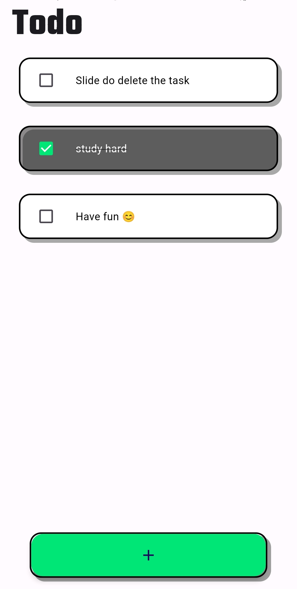

# Todo_App

A Todo app created using **Hive** database.



# Getting Started

1. Clone the repository:

   ```
   git clone https://github.com/GosuCode/todo_app.git
   ```

2. Install dependencies
   ```
   flutter pub get
   ```

Run the app and you are ready to go!
